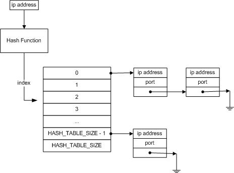

EECE 494 - Assignment 2
+++++++++++++++++++++++

Questions
----------
1. A short description of how you implemented your data structure. Often a picture is worth a thousand words. [5 points]
2. The average time to perform a lookup. [2 points]
3. An estimated average throughput of a switch built using this routing table (in packets per second), given that you have 40,000 entries in your routing table. [2 points]
4. An estimate of the worst-case time to perform a lookup. In the first implementation describe dabove (the one that required too much storage), the time to perform a lookup is constant. In the second implementation described above, the worst-case lookup will involve searching through all n entries before finding the correct IP address (instead of n/2 entries, which is average case). I want you to estimate what is the worst case for your particular implementation, and measure it. You will have to modify main.c to measure this (it might involve loading a particular set of IP addresses into the routing table). In your report file, describe 
  a. an estimate of what the worst case would be in your implementation (in terms of the number of entries in the table, n) [2 points], and 
  b. your measured estimate of this worst case [2 points]. Note that, although the worst-case time is important, it is the average-case time you should be optimizing for in this network switch case.

Answers
-------
1. The routing table is stored in a hash table. As with all hash tables, collisions may occur; collisions are resolved via direct chaining.

    The IP address is used to compute the index in which to insert the IP address/port combination. If it is found that the index is already taken (e.g. collision has occurred) then we append the item to the tail end of the linked list.

| 

2. As the time to perform a lookup is related to the set of IP addresses in the routing table, we computed the average time by running the program 10 times and computing the mean of results. As such, average time to perform a lookup was calculated to be *0.172 microseconds*.

3. From the result found in Question 2, the average throughput of the switch would equate to: 1/[1.72 x 10^(-7)] = 5 813 953 which implies that such a routing table would have an average throughput of approximately *5 813 953 packets per second*.

4. The worst-case lookup will occur when the hash function outputs the same index for all the keys. As a result of the direct chaining, a look-up could potential require traversing all 40 000 entries of a linked list to find a matching IP address. 
  a. In O notation, the worst-case lookup would equate to O(n). 
  b. Such a case can be tested by setting the hash table size to 1. For each lookup in this table, it took *736.54 microseconds*.

