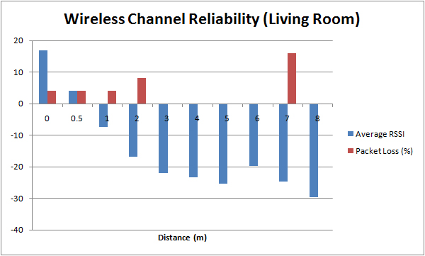

.. CoverPage
   
.. class:: title

EECE 496

.. class:: subtitle

Assignment 3 Report

Date of Submission:
    | |date|

Group Number:
    | 12

Authors:
    | Jason Poon (21736053)
    | Malihsa Haddidi (25043050)
    | Neeraj Prasher (23389059)
    | Regina So (62104047)

.. raw:: pdf

   PageBreak

.. TOC

.. contents:: Table of Contents
   :depth: 2

Task 0B: Develop a Project Plan
===============================

Task Distribution
-----------------
* Jason - Task 1, overhead (report, submitting assignment)
* Neeraj - Task 2 (implement EDF)
* Malihsa - Task 3
* Regina - Task 2 (test cases), Task 4

Team Deadlines
--------------
* March 5 - Dev-Environment Setup (git, build nano-rk successfully)
* March 8 - Task 2 Code Freeze
* March 11 - Task 1, 3 Code Freeze
* March 15 - Complete Testing and Bug-Fixing (test cases for Task 2 should be completed by this date)
* March 16 - Documentation and Report Deadline
* March 17 - Assignment Hand-in

Task 1: Get to Know the Wireless Radio
======================================

In order to accurately measure the packet loss rate, each message that a wireless node transmits is prepended with a sequence number.
For each message that the node sends, the sequence number is increased.
Under the assumption that packets arrive in-order, if the receiver receives a packet with an unexpected sequence number, it can then determine how many packets were lost.

.. code-block:: python

   number of lost packets = expected sequence number - received sequence number

Once we have calculated the number of lost packets, we can then calculate the average packet loss rate with the equation:

.. code-block:: python

   packet loss rate = (num packets lost)/(num packets sent) * 100

For the purposes of this discussion, there are two types of wireless nodes: gateway and client.
The gateway node refers to the node that is physically connected to a computer via the USB flasher.
The client, on the otherhand, is the node that is wirelessly transmitting packets.

The client sends a pre-determined number of packets to the gateway where the gateway will then output all the received packets to the console (via serial connection -- minicom) for further processing. 
The client is then moved to a different distance and the test is repeated.

At each distance measured, the average RSSI and packet loss rate is calculated from the data gathered.
Although these calculations could have been performed on the node themselves, in order to ensure that no packets are lost due to buffer issues or the calculation task pre-empting the communication task, the calculation of the packet loss is instead done in a Python script (calcPktLoss.py).

The RSSI and average packet loss rate was measured at two different locations: hallway of the Kaiser building and the living room of a house.

All data was retreived on Firefly v2.3.

   Measurements were taken in the living room of a home.

   The reliability of the wireless channel was measured in a corridor of 4th floor Kaiser. 
   The maximum distance for communication between the nodes is roughly 55m, but at that point, packet loss was in the high 90%.

 

   As the average RSSI increases, packet loss increases.

As the figures above show, When placed in close proximity of each other, the RSSI values is a positive number where the value of the RSSI decreases with an increase in distance between the nodes.
A contributing factor to determining the average packet loss is distance.
As the distance increased, the average packet loss rate increased as well.
Other environmental factors can also affect the average packet loss.
An example is that objects situated between the motes can interfere with the radio signal potentially causing packet loss.

Task 2: Earliest Deadline First
===============================

Task 3: Stack-based Resource Access Protocol
============================================

Task 4: Fixed Length Ticks vs Variable Length Ticks
===================================================

.. |date| date:: %B %d, %Y
